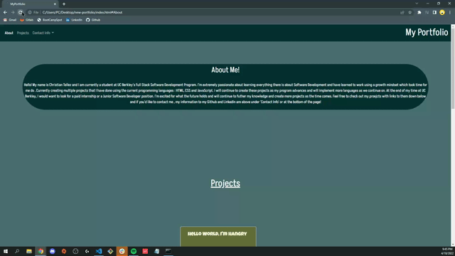
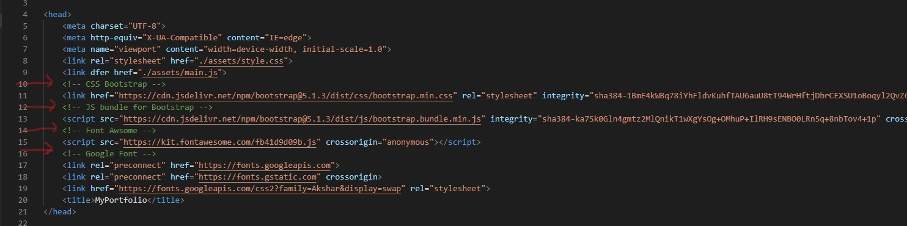

# <em> new-portfolio
#
## <em> Deploy Link : https://tellez215.github.io/new-portfolio/

## <em> Description
Created this portfolio page to display some of my new projects and provide some links so users can have access to me and contact me with any questions or conerns they might have. I linked my Github account so users can visit and view my repositories and even add more content to any of my posted repositories. I have also linked my LinkedIn so users and potential employeers can contact me thru LinkedIn or for networking purposes as well.

## <em>Visuals

 This shows you how the whole page looks like as of now. There will be more UX designing later on but as of now this is what I have.

 Describing and commenting on what the links are.

## <em> Learning Points
- Better understanding on Bootstrap and how to implement my work and colors within Bootstraps layout.

- How to add icons from Fontawsome and add color to the icons.

- Better git flow and commiting as I proceed with new sections of my HTML.

- CSS flex and spacing items around my page.

- Getting better at commenting on my HTML to describe what the line of code is doing.

## <em> License
[MIT](./license.md)